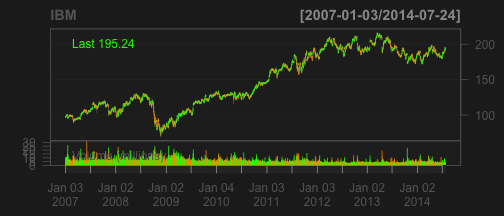
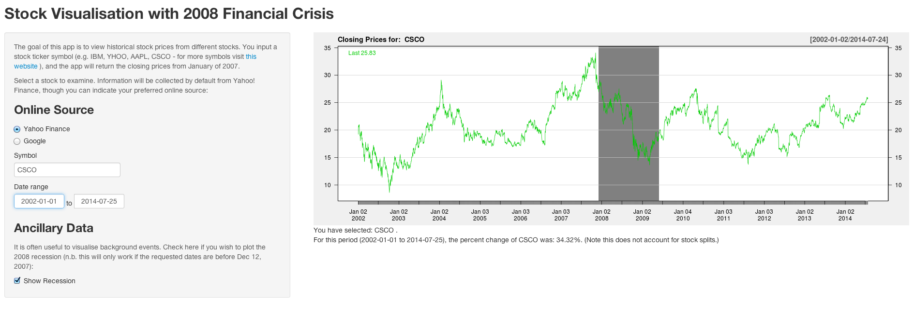

## Goals

* Create a Shiny app to:
    + plot a stock based on user input (default to [IBM](www.ibm.com))
    + allow the user to specify the online source (e.g. [Google](https://www.google.com/finance))
    + allow a date range
    + allow the user to overlay the 2008 financial crisis as a rectangle (required `addTA` from `quantmod`)
    + Calculate the % change in the stock over the input time

--- .class #id 

## Stand on the Shoulders of Giants

* I used the shiny tutorials for inspiriation, and did the backend lifting with the `quantmod` library


```r
library(quantmod)
getSymbols('IBM')
```

```
## [1] "IBM"
```

```r
chartSeries(IBM)
```

 


---

## Results 1

Here is a static pic of my app

<div style='text-align: center;'>
    
</div>


---

## Results 2

Note the change in the stock, date and in the percent change as compared to previous slide

<div style='text-align: center;'>
    
</div>

* My App can be viewed [here](http://robschick.shinyapps.io/myStockVis/).
* Code is on Github ([myStockvis Repo](https://github.com/robschick/myStockVis))
